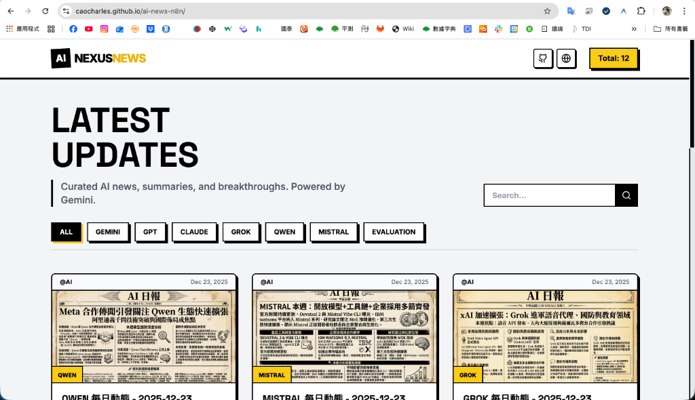
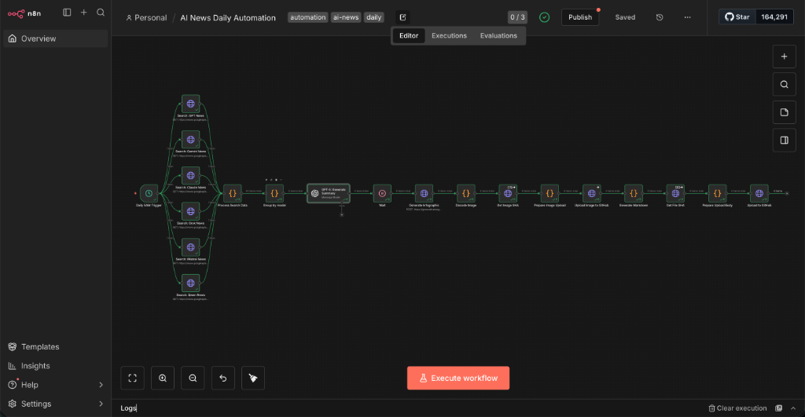
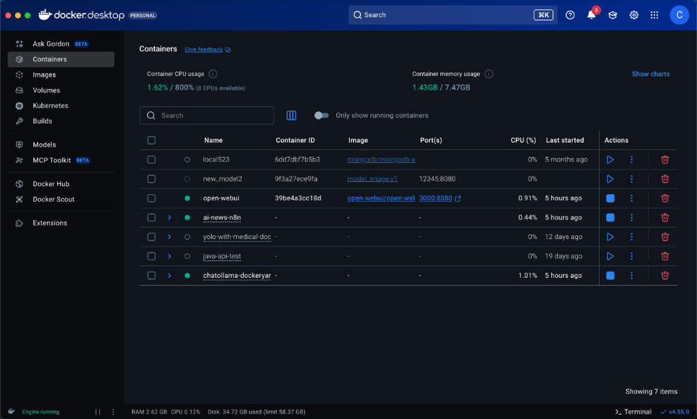

# 🤖 AI Nexus News

[](https://github.com/CaoCharles/ai-nexus/actions)
[](https://caocharles.github.io/ai-nexus/)

自動化 AI 新聞聚合平台，使用 n8n 工作流自動抓取、分析並發布六大 AI 模型的最新動態。

**🌐 Live Demo: [https://caocharles.github.io/ai-nexus/](https://caocharles.github.io/ai-nexus/)**

---

## 📸 系統截圖

### 網站首頁



### n8n 自動化工作流



### Docker 容器運行狀態



---

## ✨ 功能特色

- 🔄 **自動化新聞抓取** - 定時從多個來源抓取 AI 相關新聞
- 🤖 **AI 深度分析** - 使用 GPT 自動生成繁體中文摘要與分析
- 📊 **資訊圖表生成** - 自動生成精美的新聞資訊圖
- 🌐 **自動部署** - 透過 GitHub Actions 自動部署到 GitHub Pages
- 📱 **響應式設計** - Neo-Brutalist 風格的現代化介面

## 🎯 支援的 AI 模型

| 模型 | 官方 |
|------|------|
| 🟢 GPT | OpenAI |
| 🔵 Gemini | Google DeepMind |
| 🟠 Claude | Anthropic |
| ⚫ Grok | xAI |
| 🟣 Mistral | Mistral AI |
| 🔴 Qwen | Alibaba |

---

## 🛠️ 技術架構

```
┌─────────────────────────────────────────────────────────────┐
│                    n8n 自動化工作流                          │
│      ┌─────────┐       ┌─────────┐       ┌─────────┐        │
│      │ Google  │   →   │  GPT    │   →   │ GitHub  │        │
│      │ Search  │       │ 分析    │       │ 推送    │        │
│      └─────────┘       └─────────┘       └─────────┘        │
└─────────────────────────────────────────────────────────────┘
                            ↓
┌─────────────────────────────────────────────────────────────┐
│                  GitHub Repository                          │
│  site/_posts/*.md  +  site/assets/img/posts/*.png          │
└─────────────────────────────────────────────────────────────┘
                            ↓
┌─────────────────────────────────────────────────────────────┐
│              GitHub Actions 自動部署                         │
│               deploy-new-site.yml                           │
└─────────────────────────────────────────────────────────────┘
                            ↓
┌─────────────────────────────────────────────────────────────┐
│              React 網站 (GitHub Pages)                      │
│         https://caocharles.github.io/ai-nexus/          │
└─────────────────────────────────────────────────────────────┘
```

---

## 📂 專案結構

```
ai-nexus/
├── .github/workflows/     # GitHub Actions 部署配置
├── new-site/              # React 網站原始碼
│   ├── App.tsx            # 主應用程式
│   ├── components/        # UI 元件
│   └── scripts/           # 文章生成腳本
├── site/
│   ├── _posts/            # Markdown 文章 (n8n 推送)
│   └── assets/img/posts/  # 資訊圖 (n8n 推送)
├── workflows/             # n8n 工作流 JSON 備份
├── docs/                  # 文件與截圖
├── docker-compose.yml     # Docker 配置
└── spec.md                # 專案規格說明
```

---

## 🚀 快速開始

### 前置需求

- Docker & Docker Compose
- Node.js 18+
- GitHub Account 與 Personal Access Token

### 1. 啟動 n8n

```bash
docker-compose up -d
```

n8n 將在 `http://localhost:5678` 啟動。

### 2. 匯入工作流

1. 開啟 n8n 介面
2. 建立新工作流
3. 匯入 `workflows/AI News Daily Automation.json`

### 3. 設定憑證

在 n8n 中設定以下憑證：
- **GitHub API** - 用於推送文章到 GitHub
- **OpenAI API** - 用於 GPT 新聞分析
- **Google Custom Search API** - 用於搜尋新聞

### 4. 本地開發網站

```bash
cd new-site
npm install
npm run dev
```

---

## ⚙️ 環境變數

複製 `.env.example` 為 `.env` 並填入：

```env
# n8n 設定
N8N_BASIC_AUTH_USER=admin
N8N_BASIC_AUTH_PASSWORD=your_password

# API Keys (在 n8n 內設定)
GITHUB_TOKEN=ghp_xxxx
OPENAI_API_KEY=sk-xxxx
GOOGLE_API_KEY=AIzaxxxx
GOOGLE_CX=xxxxxx
```

---

## 📅 自動執行排程

工作流預設在每週一、三、五的台灣時間早上 5:00 自動執行。

可在 n8n 的 `Daily 5AM Trigger` 節點中調整 cron 表達式：
```
0 5 * * 1,3,5  # 週一、三、五 05:00
```

---

## 📄 授權

MIT License

---

## 🙏 致謝

- [n8n](https://n8n.io/) - 自動化工作流平台
- [OpenAI](https://openai.com/) - GPT 模型
- [React](https://reactjs.org/) - 前端框架
- [Vite](https://vitejs.dev/) - 建置工具
