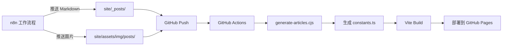

# AI Nexus News - React 網站模板

這是一個使用 React + Vite 建構的 AI 新聞聚合網站，採用 Neo-Brutalist 設計風格。

## 🚀 功能特色

- **現代化 UI**: Neo-Brutalist 設計風格，視覺效果強烈
- **AI 摘要功能**: 整合 Gemini API 進行文章摘要
- **自動化部署**: 支援 n8n 工作流程自動更新
- **分類篩選**: 支援 Claude、Gemini、GPT、Grok、Qwen、Mistral 等分類
- **響應式設計**: 支援桌面與行動裝置

## 📁 專案結構

```
ai-nexus/
├── new-site/                    # React 網站
│   ├── components/              # React 元件
│   ├── scripts/
│   │   └── generate-articles.cjs  # Markdown 轉換腳本
│   ├── public/images/           # 圖片資源
│   ├── constants.ts             # 文章資料 (自動生成)
│   └── package.json
├── site/                        # Markdown 文章來源
│   ├── _posts/                  # n8n 推送 Markdown 到這裡
│   └── assets/img/posts/        # n8n 推送圖片到這裡
└── .github/workflows/
    └── deploy-new-site.yml      # GitHub Actions 部署
```

## 🔄 n8n 自動更新工作流程

### 整體架構



### n8n 需要做的事

1. **生成 Markdown 文章**，標準 Jekyll 格式：
   ```yaml
   ---
   title: "CLAUDE 每日動態 - 2025-12-22"
   tagline: "彙整 10 則 CLAUDE 相關新聞"
   date: 2025-12-22
   model: claude
   categories: [claude, daily]
   tags: [CLAUDE, AI, Digest]
   image: /assets/img/posts/2025-12-22-claude-infographic.png
   ---
   
   ## 本週模型趨勢
   文章內容...
   ```

2. **推送到 GitHub**：
   - 文章：`site/_posts/YYYY-MM-DD-model-daily.md`
   - 圖片：`site/assets/img/posts/YYYY-MM-DD-model-infographic.png`
   - 分支：`new-template`

3. **就這樣！** GitHub Actions 會自動處理剩餘步驟

### 支援的 model 類型

| model 值 | 顯示分類 |
|----------|----------|
| `claude` | Claude |
| `gemini` | Gemini |
| `gpt` | GPT |
| `grok` | Grok |
| `qwen` | Qwen |
| `mistral` | Mistral |
| `general` / `evaluation` | Evaluation |

## 🛠️ 本地開發

### 安裝依賴
```bash
cd new-site
npm install
```

### 啟動開發伺服器
```bash
npm run dev
# 訪問 http://localhost:3000
```

### 手動生成文章資料
```bash
npm run generate
```

### 建構生產版本
```bash
npm run build
# 輸出到 new-site/dist/
```

## 📦 部署設置

### 1. 推送程式碼
```bash
git checkout new-template
git add -A
git commit -m "Update content"
git push origin new-template
```

### 2. 設置 GitHub Pages
1. 前往 Repository → Settings → Pages
2. Source 選擇 **GitHub Actions**
3. 等待 Actions 完成部署

### 3. 訪問網站
```
https://caocharles.github.io/ai-nexus/
```

## 🔧 轉換腳本說明

`scripts/generate-articles.cjs` 做的事情：

1. **讀取** `site/_posts/` 目錄中的所有 `.md` 檔案
2. **解析** YAML frontmatter 取得標題、日期、分類等資訊
3. **提取** 文章內容摘要
4. **對應** model 類型到 React Category enum
5. **複製** 圖片從 `site/assets/img/posts/` 到 `new-site/public/images/`
6. **生成** `constants.ts` 供 React 應用程式使用

### 圖片對應邏輯

腳本會自動尋找對應的 infographic：
- `2025-12-22-claude-daily.md` → `2025-12-22-claude-infographic.png`
- 若找不到，使用預設的 Unsplash 圖片

## 📝 n8n GitHub 推送節點設置

在 n8n 中使用 **GitHub** 節點，設置如下：

- **Operation**: Create/Update File
- **Repository**: `CaoCharles/ai-nexus`
- **Branch**: `new-template`
- **File Path**: 
  - 文章：`site/_posts/{{ $json.filename }}`
  - 圖片：`site/assets/img/posts/{{ $json.image_filename }}`
- **Commit Message**: `Auto update: {{ $json.filename }}`

## 🔗 相關資源

- [Vite 官方文檔](https://vitejs.dev/)
- [GitHub Actions 文檔](https://docs.github.com/en/actions)
- [n8n 官方文檔](https://docs.n8n.io/)

---

*由 AI 輔助生成，最後更新：2025-12-23*
